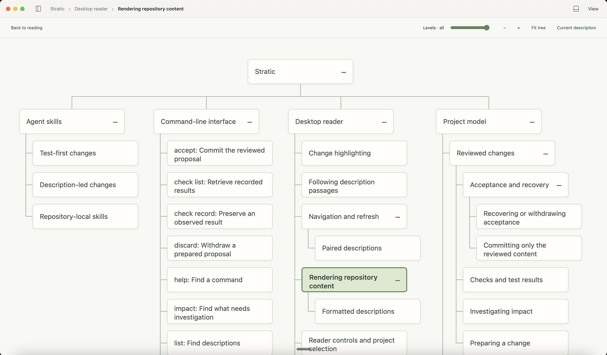
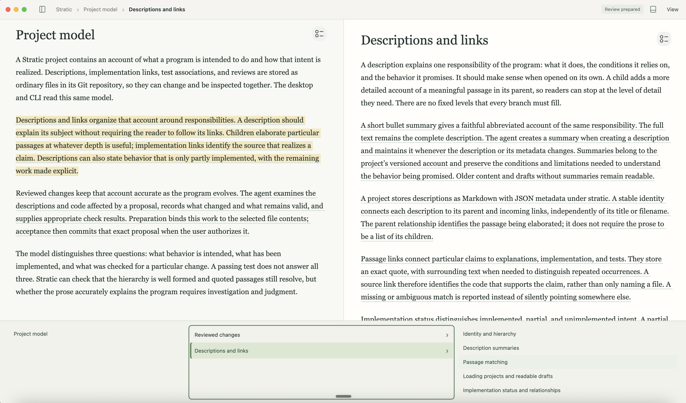

# Stratic

Stratic gives people and coding agents a shared description of a program: what
it should do, how its parts fit together, and which code and tests realize it.
Descriptions form a hierarchy you can explore in a desktop reader. As the program
changes, the agent keeps the descriptions and their links accurate.
Stratic consists of a CLI, a skill for coding agents, and a desktop UI.

<p>
  <a href="docs/images/stratic-tree.png"></a>
  <a href="docs/images/stratic-reader.png"></a>
</p>

## Installation

Stratic is an early alpha release, provided “as is”, without warranty. Expect bugs
and changes as it develops.

Requires Node.js 24+ and Git.

```sh
npm install -g @lschiemanowski/stratic
```

## Explore an example

Stratic describes itself. Download this repository and open it in the reader:

```sh
git clone https://github.com/lschiemanowski/stratic.git
```

```sh
stratic open ./stratic
```

On Linux, you may encounter an Electron sandboxing issue, due to AppArmor or similar. Fixing this may require administrator privileges. Ask your coding agent to diagnose the issue and explain a suitable fix.

Follow linked passages to read more detail or inspect the code and tests alongside
an explanation. Use the arrow keys to move through the descriptions.

## Work with a coding agent

To work with Stratic on a new project, give your coding agent this prompt:

```text
Set up Stratic in the current working directory for our work together.
Initialize Git if needed. Run `stratic skill install`, then read
.agents/skills/stratic/SKILL.md and Stratic's bundled
docs/data-model.md. Initialize Stratic's project files with an unimplemented
placeholder root description, and make an initial commit of the setup files.
Do not design or implement the program, or ask about its requirements yet.
Confirm that setup is ready, then wait for me to start that discussion.
```

To work in an existing codebase, you can use this prompt:

```text
Set up Stratic in the current working directory. Run `stratic skill install`,
then read .agents/skills/stratic/SKILL.md and Stratic's bundled docs/data-model.md.
Inspect the code and tests, then create a small hierarchy explaining the program's
purpose and responsibilities, with bullet summaries and links to relevant code
and tests. Flag uncertain intent for discussion. Preserve the existing behavior
and show me the descriptions before making implementation changes.
```

## Open the reader

To read your project's descriptions:

```sh
stratic open /path/to/project
```
